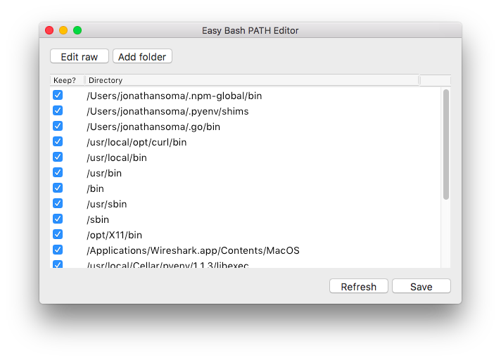

# Pathwinder

Download v0.1 of Pathwinder [here](https://github.com/littlecolumns/pathwinder/releases/download/v0.1/Pathwinder.zip).

## Add and remove folders from your PATH easily on Mac OS X

Editing your PATH is way more difficult then it should be!

Pathwinder lets you use a point-and-click interface to add and remove folders/directories from your PATH on OS X. It automatically edits your `~/.bash_profile` for you, without you needing to meddle around with hiddle files or text editors or anything like that.



## Using Pathwinder

### Where do I get it?

You can download the latest release [from GitHub](https://github.com/littlecolumns/pathwinder/releases/download/v0.1/Pathwinder.zip).

### How does it work?

Non-destructively! Easy Bash PATH Editor removes paths from your PATH with a regular expression, not by actually removing anything from the file:

```bash
sed -E "s/(:|^)\/your\/path\/here(:|^)/:/g" <<< $PATH
```

## Troubleshooting

### Help! I'm scared you're going to break something.

Every time a change is made, the old version is backed up into `~/.bash_editor_backups`.

### Help! I have something empty in my PATH.

Yeah, that'll happen if you remove the first or last element of your PATH. It won't hurt anything, but I agree that it looks weird.